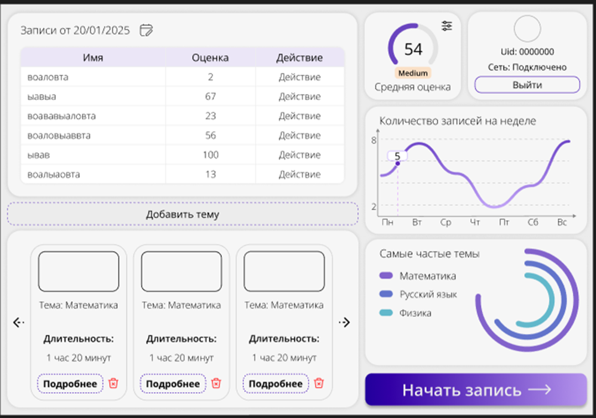

# 📊 Система анализа вовлеченности студентов на онлайн-уроках

**Автоматическая оценка вовлеченности студентов** с использованием технологий компьютерного зрения (CV) и обработки естественного языка (NLP). Система анализирует поведение студентов во время онлайн-уроков и предоставляет преподавателям детализированные отчеты.

## 🔍 Основные возможности
- **Анализ видеопотока**: определение направления взгляда, эмоций и поз студентов
- **Транскрипция аудио**: преобразование речи в текст с анализом тональности
- **Генерация отчетов**: визуализация данных о вовлеченности
- **Ролевая модель**: разделение прав преподавателей и администраторов
- **Реальное время**: обработка данных во время урока

## ⚙️ Технологический стек
| Компонент       | Технологии                                                                 |
|-----------------|----------------------------------------------------------------------------|
| **Сервер**      | Python 3.11, FastAPI, SQLAlchemy, PostgreSQL, Docker                      |
| **Клиент**      | Tkinter, OpenCV, MediaPipe, Whisper                                       |
| **CV-анализ**   | YOLO, Gaze Tracking (EAR), CNN для распознавания эмоций                   |
| **NLP-анализ**  | Whisper (транскрипция), Qwen (семантический анализ)                       |

## 🎬 Примеры работы
Клиентское приложение

## 📝 Лицензия
Проект распространяется под лицензией MIT.

## 📬 Контакты
Дмитрий Чепуштанов

Email: dmitriy.chepushtanov@mail.ru

Telegram: @ProgrammerPithoner

ВК: vk.com/ymkathebest

